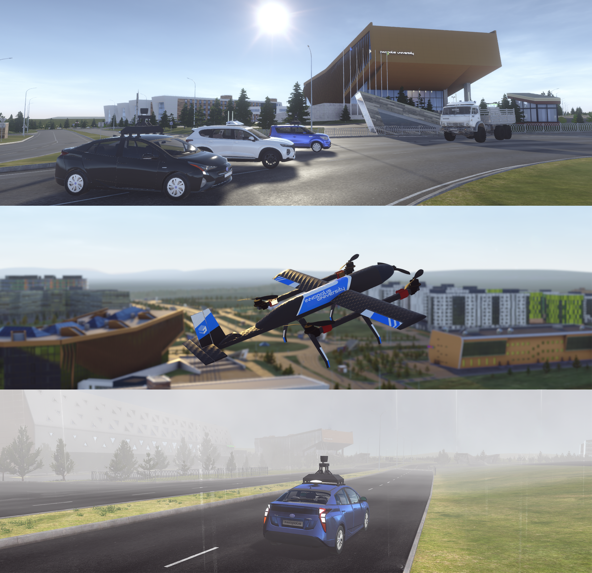

<h1 align="center">Innopolis Simulator</h1>

<div align="center">
<a href="https://github.com/inno-robolab/InnoSimulator/releases/latest">
</a>
<a href="">
</a>
</div>


<a href="Docs/Media/SimHeaderHD.png"></a>
<div align="center">
  <h4>
    <a href="https://github.com/inno-robolab/InnoSimulator/releases/latest" style="text-decoration: none">
    Download</a>
    <span> | </span>
   <a href="Docs/HowToUse.md" style="text-decoration: 
   none">How To Use</a> 
  </h4>
</div>

## Introduction
This is Unity-based robot simulator for autonomous moving objects developed by Innopolis University. Simulator could be used by autonomous vehicle developers and end-users for testing or educational purposes.

The development of a virtual environment for modeling the behavior of a robotic autonomous moving objects will significantly reduce the cost of vehicle’s development process, especially in the area of tuning and testing sensory and control equipment. This will significantly improve the safety of the car. 


## Purpose
The main purpose is to create an environment for debugging and modeling the behavior of a full-fledged model in the simulator in real time and in real 3D environment, which will avoid critical design errors, quickly clarify low-level requirements for individual nodes, shift the verification process to earlier stages, carry out more iterations of the prototype research in a short period of time and save on field tests.

## Video


[](Docs/Media/SimVid.mp4)


### Run tests with simulator
For carrying out full-scale tests and testing of the entire functionality of the simulator, [Apollo](https://github.com/lgsvl/apollo-5.0) need to be installed (preferably on another computer to achieve high-level performance). To allow the simulator communicate with Apollo you need to install Rosbridge and read installation instructions from [here](https://github.com/lgsvl/rosbridge_suite). 


1.  Run rosbridge:
```
   roslaunch rosbridge_server rosbridge_websocket.launch
```

2.  Run Apollo:To launch apollo, first launch and enter a container as described in the same [link](https://github.com/lgsvl/apollo) as in description of this chapter.
```
   ./scripts/bootstrap.sh
```

**Full description how to use simulator you can find [here](Docs/HowToUse.md).**

### Premade scenes
There're some example ready-to-use scenes. Every scene is dedicated to our team's internal requests for testing purposes. 

## Pyhton API
Innopolis Simulator supports Python API functionality. Full description can be found [here](Docs/PythonApi.md). 

